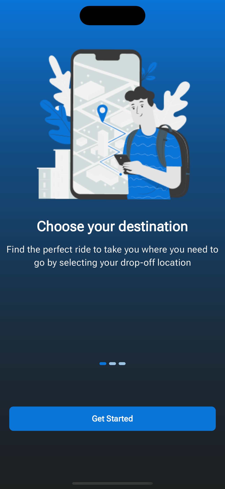

## TaxiAlong: Ride Sharing with Flexible Seating 

TaxiAlong is a mobile application that allows passengers to share taxi rides with others while specifying their preferred seating arrangements. 

## Features: 
- Shared taxi rides: Reduce costs and environmental impact by sharing a taxi with others going in the same direction.
- Seating preferences: Indicate your preferred seating location (e.g., window seat, front seat) during booking.
- (Add any other significant features here)

## Tech Stack: 
- Frontend: Flutter/Dart
- Backend: PHP/Laravel 

Screenshots:  

